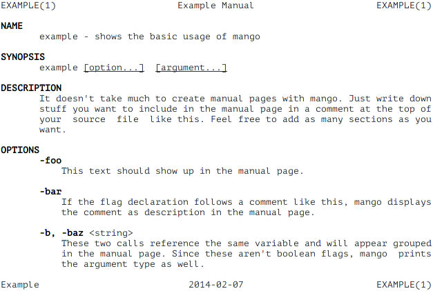

# mango

*Generate manual pages from the source code of your Go commands*

mango is a small command line utility that allows you to create manual
pages from the source code of your Go commands. It builds manual pages from
the comments and *flag* function calls found in your .go files.

#### Building

Execute
```bash
go install github.com/slyrz/mango
```
to build mango.

#### Running

Pass one or more .go files as command line arguments to mango.
mango treats them as a list of independent Go commands and creates a
manual page for each argument.

```bash
mango file1.go file2.go ...
```

## Usage

#### Source File

```go
// example - shows the basic usage of mango
//
// Description:
//
// It doesn't take much to create manual pages with mango. Just write down
// stuff you want to include in the manual page in a comment at the top
// of your source file like this. Feel free to add as many sections as you
// want.
package main

import (
	"flag"
)

var (
	optFoo = flag.Bool("foo", false, "This text should show up in the manual page.")

	// If the flag declaration follows a comment like this, mango displays the
	// comment as description in the manual page.
	optBar = flag.Bool("bar", false, "The above comment should show up in the manual page.")
	optBaz = ""
)

func init() {
	// These two calls reference the same variable and will appear
	// grouped in the manual page. Since these aren't boolean flags, mango
	// prints the argument type as well.
	flag.StringVar(&optBaz, "baz", "", "Two calls, but one entry in the manual.")
	flag.StringVar(&optBaz, "b", "", "Two calls, but one entry in the manual.")
}

func main() {
	return
}
```

#### Result



### License

mango is released under MIT license.
You can find a copy of the MIT License in the [LICENSE](./LICENSE) file.
